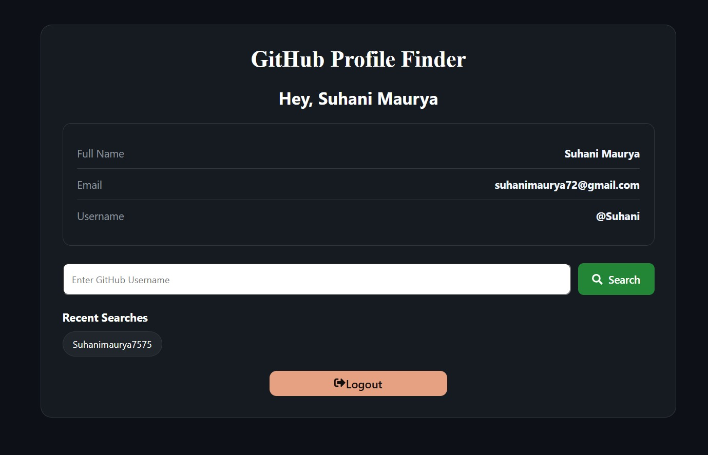
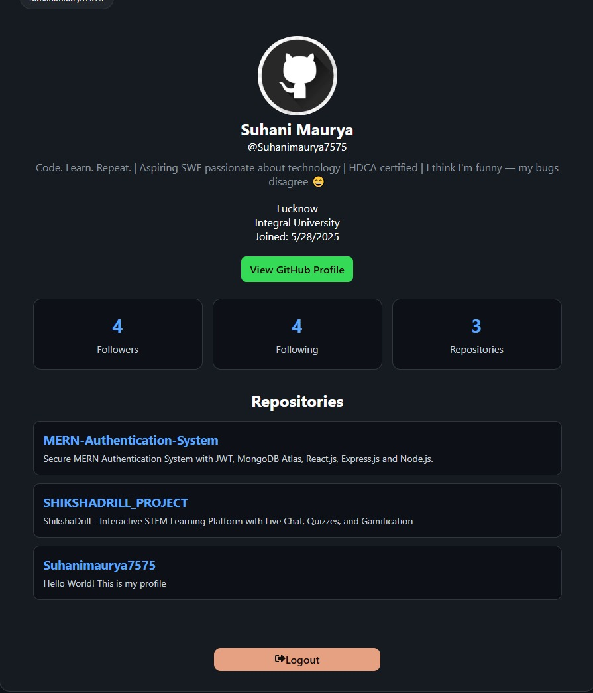

# GitHub Profile Finder

A full-stack web application that allows users to securely register, log in, and search GitHub profiles using the GitHub REST API.

---


## ✨ Features

### Authentication

* Secure User Registration
* Secure User Login
* JWT Authentication
* Password Hashing using bcrypt
* Protected Dashboard Route

### GitHub Integration

* Search GitHub Profiles
* View Profile Details
* Followers & Following Count
* Public Repository Count
* Repository Name & Description
* Direct GitHub Profile Link

### User Experience

* Loading State
* Error Handling
* Search History
* Responsive Design
* Mobile Friendly Interface

### Security

* JWT Token Verification
* Password Encryption
* Rate Limiting
* Environment Variables

---

## 🛠 Tech Stack

### Frontend

* React.js
* React Router DOM
* CSS3
* React Icons

### Backend

* Node.js
* Express.js
* MongoDB
* Mongoose
* JWT
* bcryptjs
* Axios
* Express Rate Limit

### API

* GitHub REST API

---

## 📁 Project Structure

```text
GitHub-Profile-Finder
│
├── backend
│   ├── config
│   │   └── db.js
│   ├── middleware
│   │   └── authMiddleware.js
│   ├── models
│   │   └── User.js
│   ├── routes
│   │   ├── authRoutes.js
│   │   └── githubRoutes.js
│   ├── .env
│   ├── package.json
│   └── server.js
│
├── frontend
│   ├── src
│   │   ├── pages
│   │   │   ├── Login.jsx
│   │   │   ├── Register.jsx
│   │   │   └── Dashboard.jsx
│   │   ├── services
│   │   │   └── api.js
│   │   ├── App.jsx
│   │   └── index.css
│   └── package.json
│
└── README.md
```

---

## 🔄 Application Flow

1. User creates an account.
2. Password is hashed and stored in MongoDB.
3. User logs in.
4. JWT token is generated.
5. Protected dashboard is accessed.
6. User searches a GitHub username.
7. Backend fetches data from GitHub API.
8. Profile and repositories are displayed.

---

## 🚀 Future Improvements

* Dark/Light Theme Toggle
* Repository Statistics
* GitHub User Analytics
* Favorite Profiles
* Pagination for Repositories

---


## 📸 User Interface


### Login Page


### Register Page


### GitHub Profile Search



### Dashboard



---


## 👩‍💻 Author

**Suhani Maurya**


